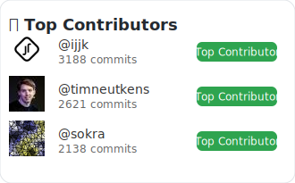

# Github Leaderboard

This is a fun README enhancement to generate a leaderboard for top contributors. It's intended to be a fun way to recognize and appreciate the most active contributors to a project.

### To use

1. Install the package: `npm install -g readme-leaderboard`
2. Run the command: `contrib`
3. Add the output to your README
   * Markdown: Paste output from terminal
   * SVG paste `` (or wherever your generated svg file lives)
4. Push the README
5. Optionally add the github workflow from this repo to generate the leaderboard on push

### Example Leaderboards

Generated from the NextJS repo because I don't have a ton of contributors on my projects

#### Markdown

### Top Contributors

-  [@ijjk](https://github.com/ijjk) — 3188 commits
-  [@timneutkens](https://github.com/timneutkens) — 2621 commits
-  [@sokra](https://github.com/sokra) — 2138 commits

#### SVG

### Roadmap

- Add support for private repos
- Make badges cooler
- Add auto-update support
- SVG badges